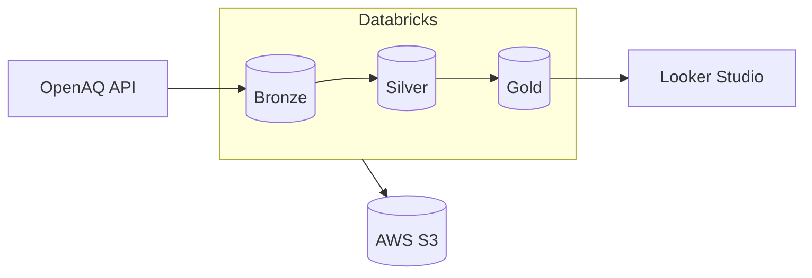
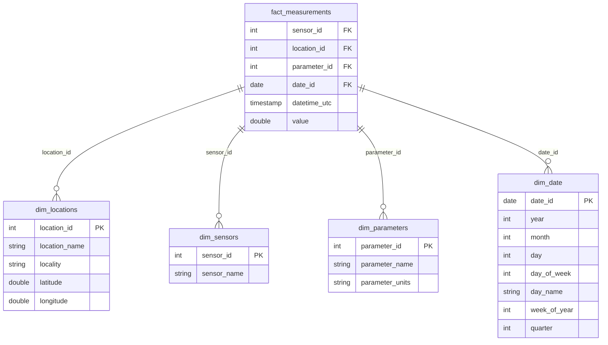

# Canada Air Quality Data Platform

Real-time air quality monitoring pipeline using Databricks, Delta Lake, and AWS S3.

[](https://databricks.com)
[](https://aws.amazon.com)

## Overview

End-to-end ELT pipeline that ingests air quality data from 480+ Canadian monitoring stations (1,400+ sensors), transforms it through a medallion architecture (Bronze → Silver → Gold), and serves it via an interactive Looker Studio dashboard.

**Key Features:**
- Hourly data ingestion from OpenAQ API
- Star schema for analytics (fact + dimensions)
- Incremental loads with MERGE (no duplicates, full history)
- Sensor health monitoring mart (down detection, flatlines, coverage, invalid readings)
- Interactive Looker Studio dashboard powered by the Gold layer

## Architecture


## Data Model

### Star Schema


### Sensor Health Marts

Two flat tables, separate from the star schema, dedicated to monitoring the sensor fleet:

| Table | Grain | Purpose |
|-------|-------|---------|
| `gold.sensor_health` | One row per sensor | Current status, a `needs_maintenance` flag and a human-readable reason: a technician's work list |
| `gold.sensor_health_daily` | One row per sensor per day | Status history for trend charts (e.g. sensors down over time) |

A sensor is evaluated on four independent signals:
- **Silence**: hours since the last valid reading (`STALE` after 24h, `DOWN` after 72h, `NEVER_REPORTED` if no data at all)
- **Flatline**: the same value repeated over and over (stuck instrument)
- **Coverage**: days with at least one reading in the last 7
- **Garbage**: transmitting, but the readings fail validation (`SENDING_INVALID`); detected by comparing what bronze received with what survived in silver

All time windows are anchored to the newest timestamp in the data (event time), so results depend on the data itself rather than on when the job runs.

## Tech Stack

| Layer | Technology |
|-------|------------|
| Ingestion | Python, OpenAQ API v3 |
| Storage | AWS S3, Delta Lake |
| Processing | Databricks, Spark SQL |
| Orchestration | Databricks Workflows |
| Governance | Unity Catalog |
| Visualization | Looker Studio |

## Project Structure
```
├── notebooks/
│   ├── 00_utils.ipynb                    # Configuration
│   ├── 01_bronze_locations_ingestion.ipynb
│   ├── 02_bronze_measurements_ingestion.ipynb
│   ├── 03_silver_transformations.ipynb
│   ├── 04_gold_star_schema.ipynb
│   └── 05_gold_sensor_health.ipynb
└── sql/
    └── catalog_and_schema_creation.dbquery.ipynb
```

## Pipeline Schedule

| Job | Schedule | Description |
|-----|----------|-------------|
| Locations | Daily 00:00 | Station metadata |
| Measurements | Hourly | Air quality readings → Silver → Gold |

## Author

**Mattia Carganico**: [LinkedIn](https://www.linkedin.com/in/mattia-ca/) | [GitHub](https://github.com/aegnor8)
